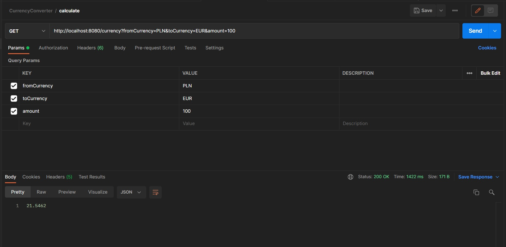

# Currency Converter App

Simple currency converter app created with Java and Spring Boot.

## Table of Contents

* [General Info](#general-information)
* [Technologies Used](#technologies-used)
* [Features](#features)
* [Screenshots](#screenshots)
* [Setup](#setup)
* [Usage](#usage)
* [Project Status](#project-status)
* [Contact](#contact)

<!-- * [License](#license) -->

## General Information

- App allows you to convert currencies in accordance with today's rates.
- Today's rates is downloaded from `http://api.nbp.pl/`.
- App allows converting currencies only from/to currency available from NBP list.
- Request is being called with 3 required parameters.
- Result of convertion is returned in the form of a floating point number.

## Technologies Used

- Java 8
- Spring Boot 2.5.6
- Rest API

## Features

List the ready features here:

- Convertion between currencies available from NBP list.

## Screenshots

## Setup

To try out the app run the following in command line:
> mvn compile

To build the JAR file run the following command:
> mvn package

To execute the JAR file run:
> java -jar target/currencyconverter-0.0.1-SNAPSHOT.jar`

## Usage

Run:
`http://localhost:8080/currency?fromCurrency=FROM_CUR&toCurrency=TO_CUR&amount=AMOUNT`
in your browser or Postman where:

`FROM_CUR` is currency you want to convert from (in ISO format),

`TO_CUR` is currency you want to convert to (in ISO format),

`AMOUNT` is amount of money you want to convert.

## Project Status

> Project is: _complete_

## Contact

Created by [@klezner](https://github.com/klezner) - feel free to contact me!

<!-- Optional -->
<!-- ## License -->
<!-- This project is open source and available under the [... License](). -->

<!-- You don't have to include all sections - just the one's relevant to your project -->
